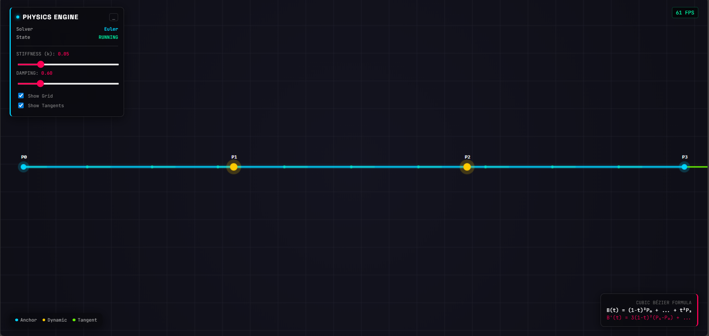
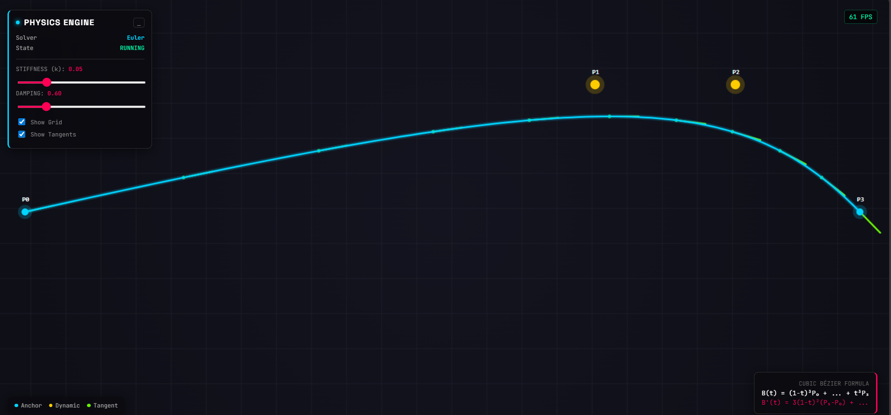

# Interactive Bézier Curve with Physics Engine

A high-performance, real-time simulation of a **cubic Bézier curve** that behaves like a **physical rope**.  
The system combines **analytical curve math**, **custom spring-damper physics**, and **GPU-efficient rendering** to maintain a stable **60 FPS** across desktop and mobile devices.

This project also serves as a **comparative engineering study** between **geometric construction (De Casteljau)** and **analytical evaluation (Bernstein Polynomials)** of Bézier curves.

---

## 🚀 Live Simulation

**Performance:** ~60 FPS stable  
**Input:** Mouse & Multi-Touch  
**Platforms:** Desktop · Tablet · Mobile  

> The curve reacts to user input with physically realistic lag, oscillation, and damping — mimicking rope-like behavior.

---

## 🧠 Algorithmic Implementation

### *Two Ways to Build the Same Curve*

During development, two mathematically equivalent Bézier implementations were explored and profiled.

---

### 1️⃣ Geometric Construction — *De Casteljau’s Algorithm*

Implemented using nested **Linear Interpolation (LERP)**.

**Conceptual Steps**
1. Interpolate between control points  
2. Interpolate between the interpolated points  
3. Repeat until a single point is obtained  

**Pros**
- Extremely intuitive
- Visually demonstrates curve construction
- Numerically stable

**Cons**
- High computational cost  
- Requires multiple LERP operations and temporary vectors per sample  

> This approach was invaluable for understanding and validating the curve geometry, but was not ideal for high-frequency rendering.

---

### 2️⃣ Analytical Evaluation — *Bernstein Polynomials* (**Active Implementation**)

The final version uses the explicit cubic Bézier formula:

```
B(t) = (1 − t)³ P₀
     + 3(1 − t)² t P₁
     + 3(1 − t) t² P₂
     + t³ P₃
```

**Why this approach was chosen**
- Constant-time evaluation per sample
- Minimal object allocation
- Reduced garbage-collection pressure
- Ideal for real-time animation loops

**Optimization Details**
- Powers of `t` are precomputed (`t²`, `t³`)
- No temporary vectors inside the render loop
- Deterministic, cache-friendly execution

> Both methods generate the *exact same curve* — the analytical form was selected purely for performance.

---

## 🛠 Physics & Motion Model

### Spring–Damper System (Hooke-Inspired)

The dynamic control points **P₁** and **P₂** do not snap to the cursor.  
They are governed by a spring-damper equation:

```
a = -k (x - x_target) - d · v
```

Where:
- **Stiffness (`k`)** controls rope tension
- **Damping (`d`)** dissipates energy and prevents infinite oscillation

This results in:
- Natural lag
- Overshoot and settling
- Stable equilibrium when input stops

Euler integration is used for simplicity and performance.

---

## 📐 Tangent & Derivative Visualization

Tangents are computed using the **exact first derivative** of the cubic Bézier curve:

```
B'(t) = 3(1 − t)²(P₁ − P₀)
      + 6(1 − t)t(P₂ − P₁)
      + 3t²(P₃ − P₂)
```

**Why this matters**
- Tangents are mathematically precise
- Enables accurate visualization of curve direction
- Demonstrates understanding of Bézier calculus

---

## ⚡ Rendering & Performance Optimizations

### 1️⃣ Batched Path Rendering
- Curve samples aggregated into a single `Path2D`
- Minimizes draw calls and CPU–GPU sync

### 2️⃣ Glow Without Expensive Filters
- Neon glow via layered alpha strokes
- Avoids `shadowBlur`, which is costly on mobile

### 3️⃣ Garbage-Free Animation Loop
- No object creation inside the render loop
- Prevents GC spikes and frame drops

### 4️⃣ Adaptive UI & Touch Support
- Unified mouse + touch input
- Stable resizing without physics artifacts

---

## 📂 Project Structure

```
.
├── index.html   # UI layout and controls
├── main.js      # Render loop and input handling
├── bezier.js    # Cubic Bézier math (Bernstein)
└── spring.js    # Spring-damper physics
```

Each file has a **single responsibility**, making the system easy to extend and reason about.

---

## 🎮 Controls & Features

- **Mouse / Touch Drag:** Interact with the rope
- **Stiffness Slider:** Adjust rope tension
- **Damping Slider:** Control oscillation decay
- **Grid Toggle:** Spatial reference
- **Tangent Toggle:** Inspect derivatives
- **FPS Counter:** Real-time performance monitoring

---
---

## 📸 Visual Preview

### Resting State (Stable Equilibrium)
The rope naturally settles into a straight configuration when no input is applied.



---

### Dynamic Response (Spring Physics in Action)
Control points respond with inertia and damping, producing smooth, realistic curvature.



---

## 🎥 Demo Video

Click below to watch the full working demonstration of the project:

[](https://youtu.be/Id9db0-g5oo)

▶️ **YouTube:** https://youtu.be/Id9db0-g5oo

This video showcases:
- Real-time Bézier curve deformation
- Spring–damper physics response
- Tangent vector visualization
- Live parameter tuning (stiffness & damping)
- Stable ~60 FPS performance

